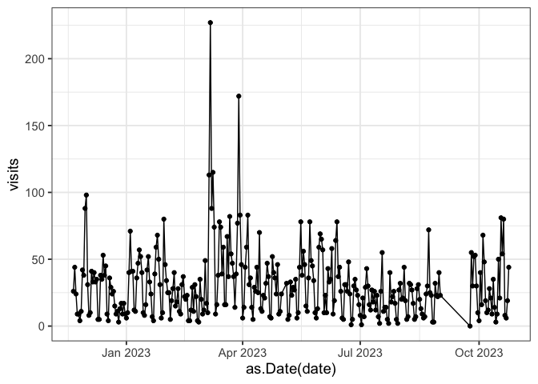

<!-- README.md is generated from README.Rmd. Please edit that file -->

# Metrics for OSF Project - ‘Working Group on NIH DMSP Guidance’

<!-- badges: start -->
<!-- badges: end -->

This repository contains code and data on metrics for the OSF project,
[Working Group on NIH DMSP Guidance](https://osf.io/uadxr/).

## Folder Contents

    .
    ├── README.Rmd                  # this README file
    ├── downloads_YYYY-MM-DD.csv    # download data, retrieved on YYYY-MM-DD
    ├── get-osf-downloads.R         # R script to get OSF downloads data
    ├── get-osf-visits.R            # R script to get OSF visits data
    ├── merge-osf-visits-data.R     # R script to combine OSF visits data
    ├── visits_YYYY-MM-DD.csv       # visit data, retrieved on YYYY-MM-DD
    ├── visits_combined.csv         # combined visit data
    └── wg-dmsp-osf-metrics.Rproj   # RStudio project file

## Stats

This README last generated on **2023-02-10**.

Most recent data gathered on **2023-02-10**.

### Downloads

``` r
downloads_file %>%
    read.csv() %>%
    arrange(desc(downloads)) %>%
    rename(file = name) %>%
    select(file, downloads) %>%
    knitr::kable()
```

| file                                                            | downloads |
|:----------------------------------------------------------------|----------:|
| Data Management and Sharing Plan Checklist for Researchers.docx |       165 |
| 2022-10-26_ExampleDMSP_annotated.pdf                            |       130 |
| Policy Readiness Checklist for Librarians.docx                  |        44 |
| Data Terms related to the NIH DMS Plan and Policy.docx          |        32 |
| Extended Reference for DMSP Checklist.docx                      |        14 |
| Example_DMSP_Metadata.xlsx                                      |        13 |
| Grant Glossary for Librarians.docx                              |        13 |
| Grant Speak in Context.docx                                     |        13 |
| license.txt                                                     |         3 |
| Working Group on NIH DMSP Guidance - template.docx              |         3 |
| Working Group on NIH DMSP Guidance - Style Guide.docx           |         3 |
| README.docx                                                     |         1 |
| Glossaries_README.docx                                          |         1 |

### Visits

``` r
visits <- read.csv("visits_combined.csv")

ggplot(visits, 
       aes(x = as.Date(date), y = visits)) + 
    geom_point() + 
    geom_line() + 
    theme_bw(base_size = 14)
```

<!-- -->
